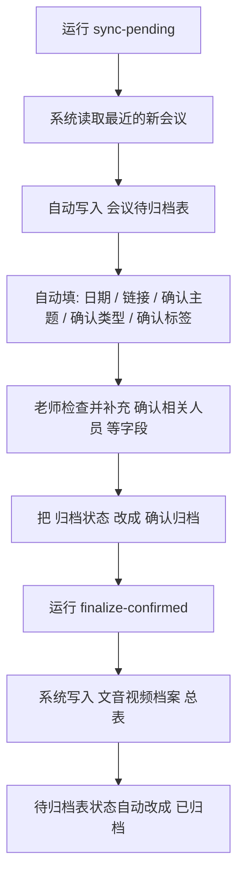

# WPS Meeting Archive

一个面向实验室会议归档场景的本地工具：自动读取 WPS 会议，先写入 `会议待归档表`，老师确认后，再正式写入 `文音视频档案` 总表。

当前版本的核心目标不是“全自动零确认”，而是：

- 自动发现最近的新会议
- 自动填写尽可能多的待归档信息
- 把人工工作压缩到“确认人员 / 主题 / 标签 / 状态”
- 保证正式归档前有人工把关，避免误写表

---

## 导师视角：一页式使用说明

如果你只是想“把最近的会议记录同步进表里，然后确认后归档”，只需要记住下面这几步：

### 第一步：先同步新会议到待归档表

在本机运行：

```bash
cd /Users/evan/wps_robot
python3 -m wps_archive --config /Users/evan/wps_robot/config.json sync-pending
```

运行后，系统会把最近的新会议自动写入 `会议待归档表`，并尽量自动填写：

- `会议日期`
- `会议链接`
- `确认主题`
- `确认相关人员`
- `确认类型`
- `确认标签`
- `归档状态`

### 第二步：在待归档表里确认信息

打开 WPS 多维表里的 `会议待归档表`，逐条检查：

- `确认相关人员`
- `确认主题`
- `确认类型`
- `确认标签`

确认无误后，把该条记录的：

- `归档状态`

改成：

- `确认归档`

### 第三步：正式归档到总表

在本机运行：

```bash
cd /Users/evan/wps_robot
python3 -m wps_archive --config /Users/evan/wps_robot/config.json finalize-confirmed
```

系统会把所有 `归档状态 = 确认归档` 的记录写入 `文音视频档案` 总表，并自动把待归档记录改成：

- `已归档`

### 平时最常用的就这两条命令

同步待归档：

```bash
python3 -m wps_archive --config /Users/evan/wps_robot/config.json sync-pending
```

正式归档：

```bash
python3 -m wps_archive --config /Users/evan/wps_robot/config.json finalize-confirmed
```

### 流程图版说明



### 使用时需要知道的 3 个现实限制

1. 需要先用目标账号授权，系统才能读取该账号发起的会议。
2. WPS 接口目前读不到“会议记录页面里手动改过的标题”，所以 `确认主题` 是根据录制/纪要内容自动提取出来的待确认值。
3. 如果会议是导师单人录音、学生没有线上入会，`确认相关人员` 可能无法完全自动识别，仍需要手动确认。

---

## 1. 项目解决什么问题

实验室会议记录原先需要手动整理到 WPS 多维表中，重复劳动主要包括：

- 找到最近新开的会议
- 打开录制或纪要链接
- 手动抄日期、主题、人员、标签
- 再把记录填写到 `文音视频档案`

这个项目把流程拆成两段：

1. 自动同步到 `会议待归档表`
2. 人工确认后再正式归档到 `文音视频档案`

这样做的好处是：

- 自动化部分尽量多做
- 有疑义的信息留给老师最后确认
- 正式表只接收已经确认的记录

---

## 2. 整体架构

项目由两部分组成：

- Python CLI
  - 调用 WPS OpenAPI
  - 拉取会议、录制、纪要、参会人、用户信息
  - 推断 `确认主题`、`确认相关人员`、`确认标签`
  - 调用 AirScript webhook 把结果写进表格
- WPS AirScript
  - `boot`：初始化或清理待归档表结构
  - `ups`：把一条候选会议写入或更新到待归档表
  - `fin`：把已确认的待归档记录写入正式表

数据流如下：

```text
WPS OpenAPI
-> Python CLI 读取最近会议
-> 生成候选记录
-> AirScript upsert 写入 会议待归档表
-> 老师确认字段并把状态改为 确认归档
-> AirScript finalize 写入 文音视频档案
-> 待归档状态自动改为 已归档
```

---

## 3. 当前目录结构

- `config.example.json`
  - 公开配置模板
- `wps_archive/`
  - Python 逻辑
- `airscript/bootstrap_pending_archive_schema.js`
  - 初始化 `会议待归档表` 字段
- `airscript/upsert_pending_archive.js`
  - 把候选会议写入 `会议待归档表`
- `airscript/finalize_pending_archive.js`
  - 把确认归档记录写入 `文音视频档案`
- `tests/`
  - 单元测试

本机私有文件：

- `config.json`
  - 真实 token / webhook / 用户配置
- `.wps_archive_state.json`
  - 上次同步时间

这两个文件都不应提交到公开仓库。

---

## 4. WPS 表结构要求

### 4.1 正式表：`文音视频档案`

项目默认写入这几个正式字段：

- `主题`
- `日期`
- `相关人员`
- `类型`
- `标签`
- `链接`

建议在正式表里额外保留两个隐藏字段，便于追踪和防重：

- `会议唯一ID`
- `来源会议标题`

### 4.2 待归档表：`会议待归档表`

当前项目最终使用的字段为：

- `会议ID`
- `会议标题`
- `会议日期`
- `会议链接`
- `确认相关人员`
- `确认主题`
- `确认类型`
- `确认标签`
- `归档状态`
- `备注`

`归档状态` 选项建议固定为：

- `待确认`
- `确认归档`
- `已归档`
- `忽略`

---

## 5. AirScript 三个脚本分别做什么

### 5.1 `boot`

用途：

- 初始化 `会议待归档表`
- 补齐缺失字段
- 清理旧字段 / 重复字段 / 不再使用的字段

什么时候运行：

- 第一次搭建时
- 待归档表字段结构变化时

正常日常使用不需要反复运行。

### 5.2 `ups`

用途：

- 接收 Python 传来的候选会议参数
- 在 `会议待归档表` 中新增或更新记录

特点：

- 以 `会议ID` 为主键查重
- `确认相关人员` 已经手动填过时，不覆盖
- `确认标签` 已经不是默认值时，不覆盖
- `已归档 / 忽略 / 确认归档` 状态的记录不会被自动同步覆盖

### 5.3 `fin`

用途：

- 扫描 `会议待归档表`
- 找出 `归档状态 = 确认归档` 的记录
- 写入 `文音视频档案`
- 成功后把待归档状态改成 `已归档`

---

## 6. Python CLI 做什么

Python CLI 是整个流程的“桥接层”，负责：

- 调 WPS OpenAPI 拉会议数据
- 做 token 鉴权
- 读取会议详情、录制、纪要、参会人、用户信息
- 推断 `确认主题`
- 推断 `确认相关人员`
- 推断 `确认标签`
- 把结果通过 webhook 发给 `ups`
- 调用 `fin` 完成正式归档

所以：

- 没有 Python CLI，就不能自动发现最近的新会议
- 只有 AirScript 时，可以做“写表”和“归档”，但不能完整做“自动拉会议”

---

## 7. 配置文件说明

先复制模板：

```bash
cp /Users/evan/wps_robot/config.example.json /Users/evan/wps_robot/config.json
```

然后填写：

- `auth`
  - `access_token`
  - `client_id`
  - `client_secret`
  - 可选 `authorization_code`
  - 可选 `redirect_uri`
- `meetings`
  - 各类 WPS OpenAPI 地址
  - `mentor_user_id`
  - `mentor_name`
  - `safe_lookback_days`
- `airscript`
  - `api_token`
  - `upsert_pending_archive_webhook`
  - `finalize_pending_archive_webhook`
- `archive`
  - 默认类型
  - 排除人员
  - 主题-人员映射

### 7.1 关于 token

当前最稳的使用方式是：

- 用目标账号获取 `user access token`
- 写入 `config.json`
- 再执行 `sync-pending`

注意：

- `user access token` 通常有效期约 2 小时
- 过期后需要重新授权或更新 token

---

## 8. 主题、人员、标签是怎么推断的

### 8.1 `确认主题`

优先级如下：

1. 如果会议标题本身符合统一格式：

```text
成员姓名1、成员姓名2_会议主题
```

则直接取下划线右侧作为主题。

2. 如果标题不是统一格式，则从录制内容中提取：

- `chapters` 的首个有效章节标题
- `summary` 的首个 Markdown 标题
- `transcript` 中的主题短语

提取策略已做过保守化处理：

- 不轻易把长主题压缩成 `健康影响`、`科学问题`、`机制`、`模型` 这种过泛词
- 如果原始候选里带 `航空排放`、`电厂排放`、`健康暴露` 等来源限定词，最终主题会尽量保留这些限定词
- 如果只能提到泛词，宁可留空，也不强行写一个不够具体的主题

### 8.2 `确认相关人员`

推断顺序如下：

1. 结构化标题直接解析姓名
2. 参会人列表 + 用户详情接口解析中文姓名
3. 若前两步都拿不到，则使用 `archive.topic_people_mapping`

注意：

- 导师“单人录音”式会议里，接口往往只看到导师本人
- 这种场景下，相关人员无法仅靠参会人接口自动识别
- 因此当前仍需要老师最后确认 `确认相关人员`

### 8.3 `确认标签`

标签会根据主题做规则推断，例如：

- `数据分析`
- `数据收集`
- `模式模拟`
- `研究方向及假设`
- 默认 `方案设计`

如果待归档里已经手动改过标签，再次同步不会覆盖。

---

## 9. 人员-主题映射规则怎么改

用户现在可以直接编辑：

- [config.json](/Users/evan/wps_robot/config.json)

路径：

```json
archive.topic_people_mapping
```

推荐使用的新结构是：

```json
{
  "name": "郭鹏",
  "priority": 10,
  "include_keywords": ["电厂排放健康", "电厂排放", "电厂", "火电", "电力排放", "燃煤电厂"],
  "exclude_keywords": []
}
```

字段说明：

- `name`
  - 人员姓名
- `priority`
  - 优先级，越大越优先
- `include_keywords`
  - 命中词，至少命中一个才会进入排序
- `exclude_keywords`
  - 一旦命中，直接排除该规则

当前程序还兼容旧版：

- `keywords`

但新规则更推荐用 `include_keywords / exclude_keywords / priority`。

### 9.1 当前经验规则

- `AI辅助55版本伴随模型开发进展` 更应命中 `何金玲`
- `优化函数参数设置与结果量级问题` 更应命中 `麦泽霖`
- `NO2阈值与季节机制转换点` 更应命中 `吴燕星`
- `电厂排放健康影响...` 更应命中 `郭鹏`
- 裸词 `健康影响` 不应直接命中任何人

---

## 10. 日常操作流程

### 10.1 第一次搭建

1. 准备好 WPS 多维表
2. 在 WPS AirScript 里创建：
   - `boot`
   - `ups`
   - `fin`
3. 把仓库里的脚本内容复制进去
4. 获取 webhook
5. 填写 `config.json`
6. 运行 `boot`

### 10.2 每次日常同步

#### 第一步：更新 token

如果当前 token 已过期，先重新获取目标账号的 `user access token`。

#### 第二步：同步待归档

```bash
cd /Users/evan/wps_robot
python3 -m wps_archive --config /Users/evan/wps_robot/config.json sync-pending
```

这一步会：

- 读取最近会议
- 生成候选记录
- 写入 `会议待归档表`

#### 第三步：老师确认待归档

老师在 `会议待归档表` 中检查并确认：

- `确认相关人员`
- `确认主题`
- `确认类型`
- `确认标签`
- 把 `归档状态` 改成 `确认归档`

#### 第四步：正式归档

```bash
cd /Users/evan/wps_robot
python3 -m wps_archive --config /Users/evan/wps_robot/config.json finalize-confirmed
```

这一步会：

- 找出所有 `确认归档` 的记录
- 写进 `文音视频档案`
- 把待归档状态改成 `已归档`

---

## 11. 常用命令

### 标题解析测试

```bash
python3 -m wps_archive parse-title "栾天成、褚梦圆_臭氧反演"
```

### 只预览，不写表

```bash
cd /Users/evan/wps_robot
python3 -m wps_archive --config /Users/evan/wps_robot/config.json sync-pending --dry-run
```

### 推送一条 mock 记录到待归档表

```bash
cd /Users/evan/wps_robot
python3 -m wps_archive --config /Users/evan/wps_robot/config.json sync-mock "栾天成、褚梦圆_臭氧反演"
```

### 正式归档

```bash
cd /Users/evan/wps_robot
python3 -m wps_archive --config /Users/evan/wps_robot/config.json finalize-confirmed
```

### 运行测试

```bash
cd /Users/evan/wps_robot
python3 -m unittest discover -s tests -v
```

---

## 12. 删除待归档记录后为什么没有自动补回

这是当前流程里一个很容易误解的点：

- `ups` 不是扫描会议的脚本
- `ups` 只是“写入一条已经发现的候选记录”

如果你删掉了一条待归档记录，想让它重新出现，应该重新运行：

```bash
python3 -m wps_archive --config /Users/evan/wps_robot/config.json sync-pending
```

并且要注意：

- 当前同步只回看 `safe_lookback_days` 天
- 如果删掉的是很早之前的会议，普通同步可能不会再扫到

这时可以：

- 临时把 `safe_lookback_days` 调大
- 或删除状态文件 `.wps_archive_state.json` 后重跑

---

## 13. 当前已知限制

### 13.1 只能稳定读取“当前授权账号作为发起人”的会议

当前 WPS API 在实际测试中，对“发起人身份”场景更稳定。  
对于只是参会人而不是发起人的会议，读取能力有限。

### 13.2 公开 API 读不到“会议记录页面里手动重命名后的标题”

目前能稳定读到的是：

- 会议主题 `subject`
- 录制内容
- 纪要内容

但不能稳定直接读到客户端“会议记录”页面里手动改过的展示标题。  
所以当前 `确认主题` 主要还是依赖录制内容自动提取。

### 13.3 导师单人录音会议无法完全自动识别学生

如果会议只是导师单人录音，而学生并未作为线上参会人出现，则 API 侧通常只能看到导师本人。  
这种场景下：

- `确认相关人员` 可能需要老师手动确认
- 或依赖主题-人员映射作为弱推断

### 13.4 token 会过期

`user access token` 有效期有限，过期后需要重新授权或重新填写。

---

## 14. 故障排查

### `sync-pending` 没有新记录

先检查：

- token 是否过期
- 最近会议是否在回看窗口内
- 目标会议是否确实由当前授权账号发起

### `fin` 运行成功但正式表没有看到新记录

先检查待归档表里该条记录是否真的满足：

- `归档状态 = 确认归档`
- `确认主题` 已填写
- `确认相关人员` 已填写

### 主题过于宽泛

优先检查：

- 录制内容本身是否有足够具体的章节标题 / 摘要
- 是否需要补充 `topic_people_mapping`
- 是否需要老师手动修正 `确认主题`

### 某个人员没有自动命中

直接编辑：

- [config.json](/Users/evan/wps_robot/config.json)

在 `archive.topic_people_mapping` 中补上更明确的关键词，再重新运行 `sync-pending`。

---

## 15. 对外发布说明

公开仓库只保留安全内容：

- Python 代码
- AirScript 模板
- 测试
- README
- `config.example.json`

不会包含：

- `config.json`
- `.wps_archive_state.json`
- 真实 token
- 真实 webhook
- AppKey / APIToken

---

## 16. 参考文档

- WPS 365 OpenAPI 概述  
  [https://open.wps.cn/documents/app-integration-dev/guide/start/overview.html](https://open.wps.cn/documents/app-integration-dev/guide/start/overview.html)
- 认证与授权概述  
  [https://open.wps.cn/documents/app-integration-dev/wps365/server/certification-authorization/summary.html](https://open.wps.cn/documents/app-integration-dev/wps365/server/certification-authorization/summary.html)
- 获取用户 access_token  
  [https://open.wps.cn/documents/app-integration-dev/wps365/server/certification-authorization/get-token/get-user-access-token.html](https://open.wps.cn/documents/app-integration-dev/wps365/server/certification-authorization/get-token/get-user-access-token.html)
- AirScript APIToken 与 webhook  
  [https://airsheet.wps.cn/docs/apitoken/intro.html](https://airsheet.wps.cn/docs/apitoken/intro.html)
- AirScript API  
  [https://airsheet.wps.cn/docs/apitoken/api.html](https://airsheet.wps.cn/docs/apitoken/api.html)
