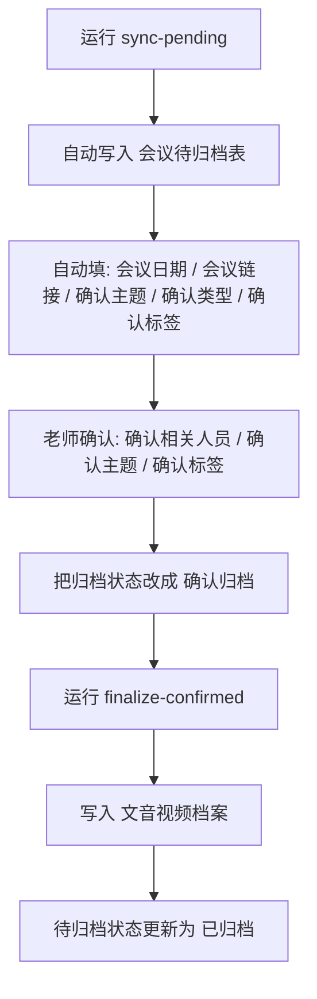

# WPS Meeting Archive

把 WPS 会议记录半自动归档到多维表。

`v0.1.0` 是首个公开发布版本：**Python CLI + 双击启动脚本**。它适合愿意用终端、也接受双击脚本打开终端运行的用户。

## 快速上手

### 你每天只需要做这几步

1. 运行 `sync-pending`
2. 在 `会议待归档表` 里确认字段
3. 把 `归档状态` 改成 `确认归档`
4. 运行 `finalize-confirmed`



## 环境要求

- Python 3.9+
- Windows 11 或 macOS
- 已配置好的 WPS 自建应用权限
- 已在 WPS 中创建并保存 3 个 AirScript：
  - `boot`
  - `ups`
  - `fin`

这个项目目前**不依赖额外第三方 Python 包**。

## 首次配置

### 1. 准备本地配置

复制模板：

- macOS / Linux

```bash
cp config.example.json config.json
```

- Windows PowerShell

```powershell
Copy-Item .\config.example.json .\config.json
```

### 2. 填写 `config.json`

至少要填这些：

- `auth.client_id`
- `auth.client_secret`
- `auth.scope`
- `auth.redirect_uri`
- `airscript.api_token`
- `airscript.upsert_pending_archive_webhook`
- `airscript.finalize_pending_archive_webhook`
- `meetings.mentor_user_id`
- `meetings.mentor_name`

如果你要自定义“主题 -> 人员”的推断规则，可以编辑：

- `archive.topic_people_mapping`

### 3. 初始化待归档表字段

在 WPS 里运行一次 `boot` 脚本。只在表结构初始化或变更时需要运行。

## 首次授权

### 推荐方式：双击运行

- Windows：双击 `run_get_user_token.bat`
- macOS：双击 `run_get_user_token.command`

### 命令行方式

- macOS / Linux

```bash
python3 -m wps_archive --config ./config.json authorize-user
```

- Windows

```bash
py -m wps_archive --config .\config.json authorize-user
```

这一步会：

1. 打开浏览器让你登录 WPS 并授权
2. 把新的 `access_token`、`refresh_token`、过期信息写回本地 `config.json`

## 自动刷新 Token

这版已经支持自动刷新用户 token：

1. 第一次需要人工授权一次
2. 后续运行时，CLI 会优先检查当前 `access_token` 是否仍有效
3. 如果过期但 `refresh_token` 还有效，会自动刷新并写回 `config.json`
4. 只有当 `refresh_token` 也失效时，才需要重新运行 `authorize-user`

## 日常运行

### 同步最近会议到待归档表

- Windows：双击 `run_sync_pending.bat`
- macOS：双击 `run_sync_pending.command`

或用命令行：

- macOS / Linux

```bash
python3 -m wps_archive --config ./config.json sync-pending
```

- Windows

```bash
py -m wps_archive --config .\config.json sync-pending
```

系统会尽量自动填：

- `会议日期`
- `会议链接`
- `确认主题`
- `确认相关人员`
- `确认类型`
- `确认标签`
- `归档状态`

### 正式归档到总表

- Windows：双击 `run_finalize_confirmed.bat`
- macOS：双击 `run_finalize_confirmed.command`

或用命令行：

- macOS / Linux

```bash
python3 -m wps_archive --config ./config.json finalize-confirmed
```

- Windows

```bash
py -m wps_archive --config .\config.json finalize-confirmed
```

## WPS 表要求

### 正式表：`文音视频档案`

需要能写入这些字段：

- `主题`
- `日期`
- `相关人员`
- `类型`
- `标签`
- `链接`

建议保留两个隐藏字段：

- `会议唯一ID`
- `来源会议标题`

### 待归档表：`会议待归档表`

需要这些字段：

- `会议ID`
- `会议标题`
- `会议日期`
- `会议链接`
- `确认相关人员`
- `确认主题`
- `确认类型`
- `确认标签`
- `归档状态`
- `备注`

`归档状态` 建议固定为：

- `待确认`
- `确认归档`
- `已归档`
- `忽略`

## AirScript 分工

- `boot`
  - 创建缺失字段
  - 清理旧字段和多余字段
- `ups`
  - 把候选会议写入 `会议待归档表`
- `fin`
  - 把 `确认归档` 的记录写入 `文音视频档案`

## 常用命令

检查配置：

```bash
python3 -m wps_archive --config ./config.json check-config --json
```

解析会议标题：

```bash
python3 -m wps_archive --config ./config.json parse-title "栾天成、褚梦圆_臭氧反演"
```

只看同步结果，不写表：

```bash
python3 -m wps_archive --config ./config.json sync-pending --dry-run
```

## 当前限制

1. 只能稳定读取当前授权账号**作为发起人**的会议
2. 公开 API 仍然读不到“会议记录页面里手动重命名后的标题”
3. 导师单人录音、学生线下在办公室的场景里，`确认相关人员` 仍可能需要人工确认

## 常见问题

### 为什么重新运行 `ups` 不会自动补回我删掉的旧记录？

因为 `ups` 只负责“写入一条已经发现的候选会议”，它不会自己重新扫描会议列表。  
要补回历史记录，请重新运行 `sync-pending`。如果记录已经超出 `safe_lookback_days`，需要临时把回看窗口改大，或重置状态文件。

### 为什么有些主题看起来还需要人工修正？

系统会优先从结构化标题、录制章节、录制摘要和转写内容中提主题，但它仍然是“尽量自动预填”，不是最终裁决。待归档表就是给人工最后确认用的。

### 为什么要同时保留 CLI 和双击脚本？

双击脚本更方便日常使用；CLI 更适合排错、自动化和会写代码的用户。
