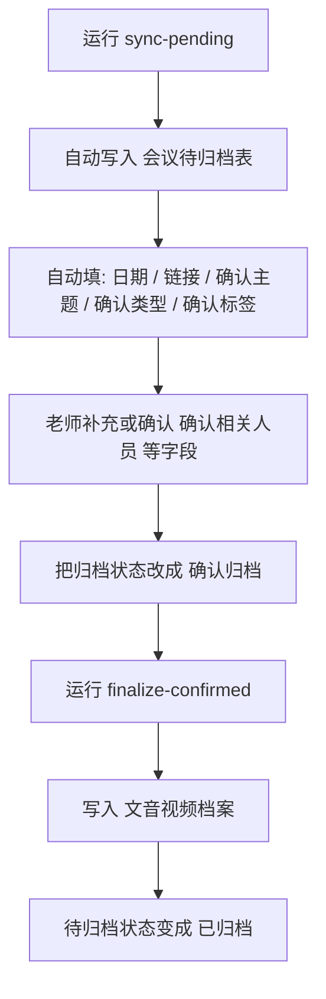

# WPS Meeting Archive

把 WPS 会议记录半自动归档到多维表。

当前流程是：

1. Python CLI 读取最近会议
2. 自动写入 `会议待归档表`
3. 老师确认字段并把状态改成 `确认归档`
4. `finalize` 把记录写入 `文音视频档案`

这不是“全自动零确认”，而是“尽量自动填，最后人工把关”。

---

## 快速上手

### 1. 同步最近会议到待归档表

```bash
cd /Users/evan/wps_robot
python3 -m wps_archive --config /Users/evan/wps_robot/config.json sync-pending
```

系统会尽量自动填写：

- `会议日期`
- `会议链接`
- `确认主题`
- `确认相关人员`
- `确认类型`
- `确认标签`
- `归档状态`

### 2. 在 `会议待归档表` 里确认

老师只需要检查并修改：

- `确认相关人员`
- `确认主题`
- `确认类型`
- `确认标签`

然后把：

- `归档状态`

改成：

- `确认归档`

### 3. 正式归档到总表

```bash
cd /Users/evan/wps_robot
python3 -m wps_archive --config /Users/evan/wps_robot/config.json finalize-confirmed
```

系统会把所有 `确认归档` 的记录写入 `文音视频档案`，并把待归档状态改成 `已归档`。

### 流程图



---

## 这个项目里有什么

- `wps_archive/`
  Python CLI，负责调 WPS OpenAPI、推断字段、调用 webhook
- `airscript/bootstrap_pending_archive_schema.js`
  初始化待归档表结构
- `airscript/upsert_pending_archive.js`
  把候选会议写入 `会议待归档表`
- `airscript/finalize_pending_archive.js`
  把确认归档记录写入正式表
- `config.example.json`
  配置模板
- `tests/`
  单元测试

私有文件：

- `config.json`
- `.wps_archive_state.json`

这两个文件不要提交到公开仓库。

---

## WPS 表结构

### 正式表：`文音视频档案`

会写入这些字段：

- `主题`
- `日期`
- `相关人员`
- `类型`
- `标签`
- `链接`

建议额外保留两个隐藏字段：

- `会议唯一ID`
- `来源会议标题`

### 待归档表：`会议待归档表`

需要这些字段：

- `会议ID`
- `会议标题`
- `会议日期`
- `会议链接`
- `确认相关人员`
- `确认主题`
- `确认类型`
- `确认标签`
- `归档状态`
- `备注`

`归档状态` 选项建议固定为：

- `待确认`
- `确认归档`
- `已归档`
- `忽略`

---

## 三个 AirScript 的作用

### `boot`

只在初始化或字段结构变化时运行。

作用：

- 创建缺失字段
- 清理旧字段 / 重复字段 / 不再使用的字段

### `ups`

把一条候选会议写入 `会议待归档表`。

特点：

- 用 `会议ID` 查重
- `确认相关人员` 已有值时不覆盖
- `确认标签` 已被人工修改时不覆盖
- `确认归档 / 已归档 / 忽略` 状态不自动覆盖

### `fin`

扫描待归档表，把 `归档状态 = 确认归档` 的记录正式写入 `文音视频档案`。

---

## Python CLI 在做什么

Python CLI 是桥接层，负责：

- 调 WPS OpenAPI 拉会议、录制、纪要、参会人、用户信息
- 推断 `确认主题`
- 推断 `确认相关人员`
- 推断 `确认标签`
- 调用 `ups` webhook
- 调用 `fin` webhook

没有 Python CLI，就不能自动发现最近的新会议。

---

## 配置

先复制模板：

```bash
cp /Users/evan/wps_robot/config.example.json /Users/evan/wps_robot/config.json
```

主要要填：

- `auth`
  - `access_token`
  - `client_id`
  - `client_secret`
- `meetings`
  - `mentor_user_id`
  - `mentor_name`
  - 各类 API 地址
- `airscript`
  - `api_token`
  - `upsert_pending_archive_webhook`
  - `finalize_pending_archive_webhook`
- `archive`
  - 默认类型
  - 排除人员
  - 主题-人员映射

说明：

- 当前最稳的是使用目标账号的 `user access token`
- token 一般有效约 2 小时，过期后需要重新授权

---

## 主题 / 人员 / 标签是怎么来的

### `确认主题`

优先级：

1. 标题符合统一格式：`成员1、成员2_主题`
2. 录制章节标题
3. 录制摘要标题
4. 转写里的主题短语

策略上会尽量保留专业限定词，不轻易压成 `健康影响`、`科学问题` 这种太泛的短词。

### `确认相关人员`

优先级：

1. 结构化标题直接解析
2. 参会人列表 + 用户详情
3. `archive.topic_people_mapping`

对于“导师单人录音、学生线下在办公室”的会议，接口往往只能看到导师本人，这种情况仍可能需要人工确认相关人员。

### `确认标签`

根据主题做规则推断，例如：

- `数据分析`
- `数据收集`
- `模式模拟`
- `研究方向及假设`
- 默认 `方案设计`

---

## 人员-主题映射怎么改

直接编辑：

- [config.json](/Users/evan/wps_robot/config.json)

路径：

```json
archive.topic_people_mapping
```

推荐结构：

```json
{
  "name": "郭鹏",
  "priority": 10,
  "include_keywords": ["电厂排放健康", "电厂排放", "电厂", "火电", "电力排放", "燃煤电厂"],
  "exclude_keywords": []
}
```

字段说明：

- `priority`：越大越优先
- `include_keywords`：至少命中一个
- `exclude_keywords`：命中就排除

旧版 `keywords` 仍兼容，但新写法更推荐。

---

## 常用命令

### 同步待归档

```bash
cd /Users/evan/wps_robot
python3 -m wps_archive --config /Users/evan/wps_robot/config.json sync-pending
```

### 只预览，不写表

```bash
cd /Users/evan/wps_robot
python3 -m wps_archive --config /Users/evan/wps_robot/config.json sync-pending --dry-run
```

### 正式归档

```bash
cd /Users/evan/wps_robot
python3 -m wps_archive --config /Users/evan/wps_robot/config.json finalize-confirmed
```

### 标题解析测试

```bash
python3 -m wps_archive parse-title "栾天成、褚梦圆_臭氧反演"
```

### 运行测试

```bash
cd /Users/evan/wps_robot
python3 -m unittest discover -s tests -v
```

---

## 常见问题

### 为什么删掉的待归档记录没有自动补回？

因为 `ups` 不是扫描脚本，真正负责重新发现会议的是：

```bash
python3 -m wps_archive --config /Users/evan/wps_robot/config.json sync-pending
```

另外同步只会回看 `safe_lookback_days` 天，太早的会议可能不会再扫到。

### 为什么有些会议识别不到相关人员？

因为 WPS API 里，导师“单人录音”会议经常只显示导师本人，没有学生账号。  
这种情况只能靠标题、映射表推断，或者人工确认。

### 为什么需要重新授权 token？

因为 `user access token` 会过期。过期后，CLI 就无法继续拉会议数据。

### 为什么读不到手动改过的会议记录标题？

当前公开 API 稳定能读到的是会议基础信息、录制内容和纪要内容，不能稳定直接读到客户端“会议记录”页面里手动改过的展示标题。

---

## 当前已知限制

- 主要适用于“当前授权账号作为发起人”的会议
- 读不到“会议记录页面手动重命名后的标题”
- 导师单人录音会议无法稳定自动识别学生
- token 会过期，需要重新授权

---

## 参考文档

- WPS 365 OpenAPI 概述  
  [https://open.wps.cn/documents/app-integration-dev/guide/start/overview.html](https://open.wps.cn/documents/app-integration-dev/guide/start/overview.html)
- 认证与授权概述  
  [https://open.wps.cn/documents/app-integration-dev/wps365/server/certification-authorization/summary.html](https://open.wps.cn/documents/app-integration-dev/wps365/server/certification-authorization/summary.html)
- 获取用户 access_token  
  [https://open.wps.cn/documents/app-integration-dev/wps365/server/certification-authorization/get-token/get-user-access-token.html](https://open.wps.cn/documents/app-integration-dev/wps365/server/certification-authorization/get-token/get-user-access-token.html)
- AirScript APIToken 与 webhook  
  [https://airsheet.wps.cn/docs/apitoken/intro.html](https://airsheet.wps.cn/docs/apitoken/intro.html)
- AirScript API  
  [https://airsheet.wps.cn/docs/apitoken/api.html](https://airsheet.wps.cn/docs/apitoken/api.html)
